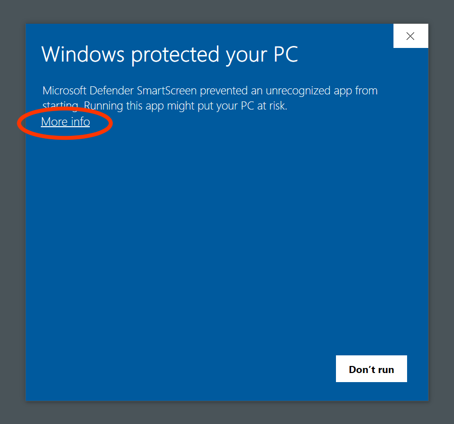

# ImagePetaPeta-beta
  

写真やイラスト資料を閲覧、管理するソフトです。
## インストール
### Windows
下記よりzipファイル **(ImagePetaPeta-beta-X.X.X-beta-win32-x64.exe.zip)** をダウンロードしてインストールしてください。  
<https://github.com/takumus/ImagePetaPeta/releases/>  
下図ような警告が出ますが、赤い枠のボタンを押せばインストールできます。  


### Mac
下記よりdmgファイル **(ImagePetaPeta-beta-X.X.X-beta-darwin-YYY.dmg)** をダウンロードしてApplicationsにドラッグしてください。  
**`YYY` は、M1やM2等をお使いの場合はarm64を、それ以外の方はIntelを選んでください。**   
ドラッグした後、`Temrminal.app` を起動し、`xattr -rc /Applications/ImagePetaPeta-beta.app` と入力し、Returnキーを押してください。  
その後は通常通りに起動できます。
<https://github.com/takumus/ImagePetaPeta/releases/>  
## ご協力
まだ開発段階のアプリなので、多くのユーザーに最新版を使っていただき、新鮮なフィードバックを貰いたいと思っております。  
そのため、アップデートの通知はオフにできないようになっています。  
よろしくお願いします。
## バグ発見！質問！または要望！
<https://docs.google.com/forms/d/e/1FAIpQLSfMVEzYwdC09SrM6ipTtHyk_wTC1n08pB2eeZIVZifIRW7ojQ/viewform>  
こちらのフォームからお願いします。  
githubアカウントをお持ちの方は、IssuesでもOKです。
# 開発者向け
## nodeとかのバージョン
`./package.json`の最後の`volta`を御覧ください。
## デバッグ
```
yarn serve
```

## ビルド
```
yarn build
```
