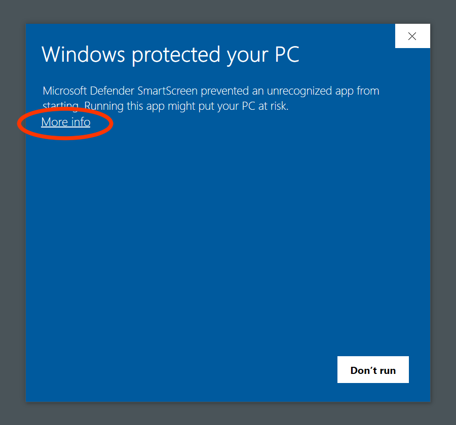
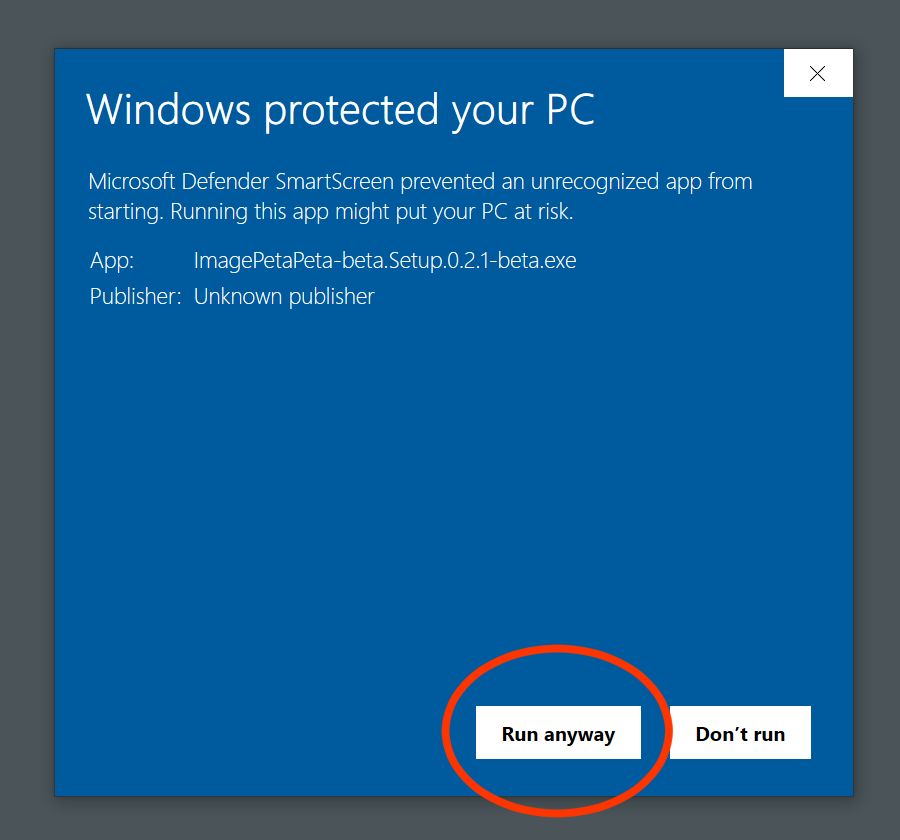
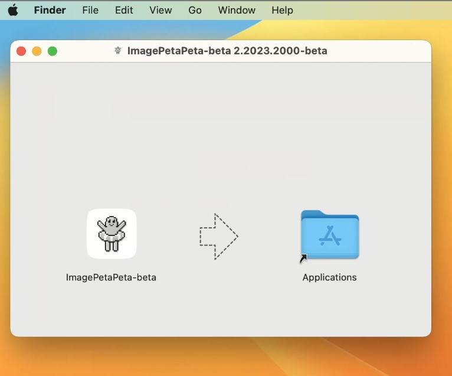
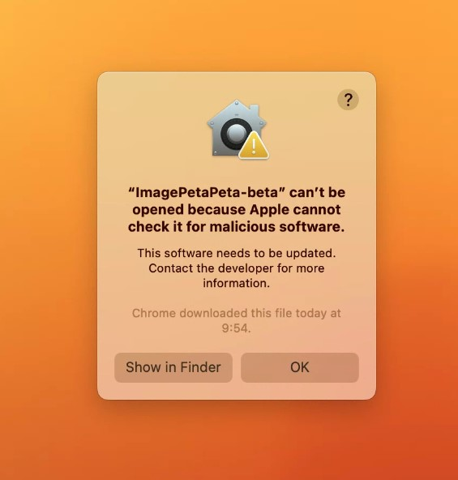
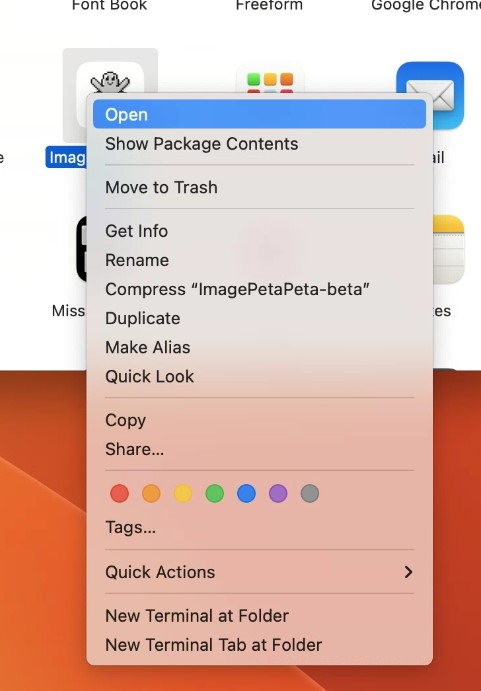

# ImagePetaPeta-beta


写真やイラスト資料を閲覧、管理するソフトです。

## インストール

### Windows

下記より zip ファイル **(ImagePetaPeta-beta-X.X.X-beta-win32-x64.exe.zip)** をダウンロードしてインストールしてください。  
<https://github.com/takumus/ImagePetaPeta/releases/>  
下図ような警告が出ますが、赤い枠のボタンを押せばインストールできます。  


### Mac

下記より dmg ファイル **(ImagePetaPeta-beta-X.X.X-beta-darwin-YYY.dmg)** をダウンロードして Applications にドラッグしてください。  
**`YYY` は、M1 や M2 等をお使いの場合は arm64 を、それ以外の方は Intel を選んでください。**  
<https://github.com/takumus/ImagePetaPeta/releases/>

#### 1. ダウンロードしたファイルを開きアプリケーションへドラッグします。



#### 2. ランチャー等からアプリを起動します。しかし開けないので、左のボタンを押しファインダーで開きます。



#### 3. アプリをダブルクリックではなく、右クリックで開きます。



#### 4. 開くを押せば起動できます。


## ご協力

まだ開発段階のアプリなので、多くのユーザーに最新版を使っていただき、新鮮なフィードバックを貰いたいと思っております。  
そのため、アップデートの通知はオフにできないようになっています。  
よろしくお願いします。

## バグ発見！質問！または要望！

<https://docs.google.com/forms/d/e/1FAIpQLSfMVEzYwdC09SrM6ipTtHyk_wTC1n08pB2eeZIVZifIRW7ojQ/viewform>  
こちらのフォームからお願いします。  
github アカウントをお持ちの方は、Issues でも OK です。

# 開発者向け

## node とかのバージョン

`./package.json`の最後の`volta`を御覧ください。

## デバッグ

```
npm run dev
```

## ビルド

```
npm run build
```
