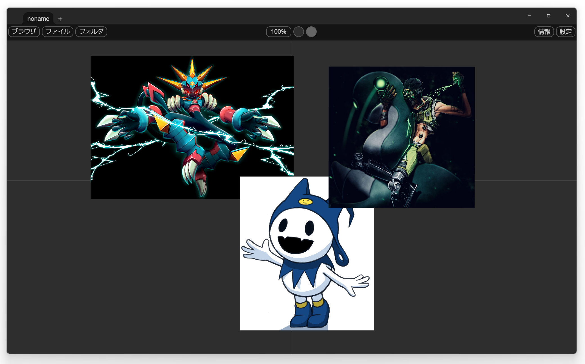
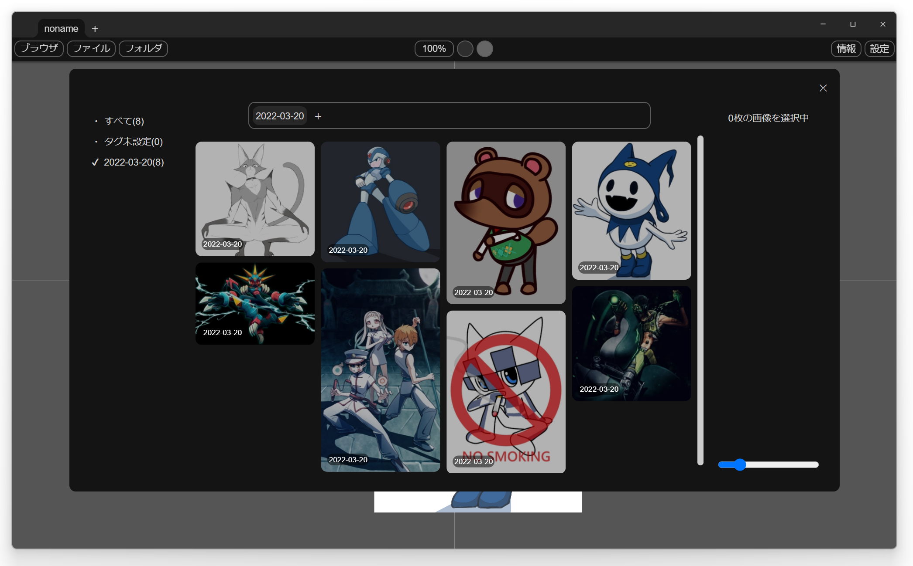

# ImagePetaPeta-beta
  
写真やイラスト資料を閲覧、管理するソフトです。
## インストール
### Windows
下記よりzipファイルをダウンロードしてインストールしてください。  
<https://github.com/takumus/ImagePetaPeta/releases/tag/2.5.6-beta>  
下図ような警告が出ますが、赤い枠のボタンを押せばインストールできます。  


### Mac
1. `package.json`の`volta`のバージョンを参考に`node`, `yarn`の環境を整えてください。  
1. [Volta](https://docs.volta.sh/guide/getting-started)をインストールでもOKです。  
2. `yarn build`  
3. `dist_electron`内に生成されたappファイルがアプリ本体です。
## ご協力
まだ開発段階のアプリなので、多くのユーザーに最新版を使っていただき、新鮮なフィードバックを貰いたいと思っております。  
そのため、アップデートの通知はオフにできないようになっています。  
小さなアップデートは高頻度で配信されますが、大きなアップデートは多くて週に１度と考えています。  
大きなアップデートのみの通知で良いという方は、`設定` → `その他` → **`マイナーアップデートの通知を無視する`** を有効にしてください。  
よろしくお願いします。
## バグ発見！質問！または要望！
<https://docs.google.com/forms/d/e/1FAIpQLSfMVEzYwdC09SrM6ipTtHyk_wTC1n08pB2eeZIVZifIRW7ojQ/viewform>  
こちらのフォームからお願いします。  
githubアカウントをお持ちの方は、IssuesでもOKです。
# 開発者向け
## nodeとかのバージョン
`./package.json`の最後の`volta`を御覧ください。
## デバッグ
```
yarn serve
```

## ビルド
```
yarn build
```
